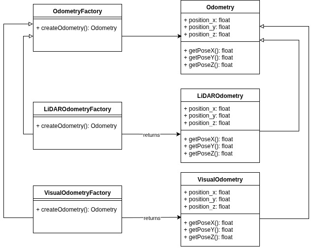

# Factory Method

## Problem

How to get odometry information by changing method at run time?

## UML Design



## File structure
```bash
├── app
│   └── demo.cpp                        # example
├── CMakeLists.txt
├── docs
│   └── 00_FactoryMethod.jpg
├── include
│   ├── lidar_odometry_factory.hpp
│   ├── lidar_odometry.hpp
│   ├── odometry_factory.hpp            # creator
│   ├── odometry.hpp                    # product
│   ├── visual_odometry_factory.hpp
│   └── visual_odometry.hpp
├── README.md
└── src
    ├── lidar_odometry.cpp
    ├── lidar_odometry_factory.cpp
    ├── visual_odometry.cpp
    └── visual_odometry_factory.cpp
```bash